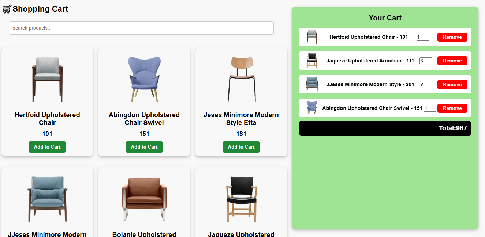
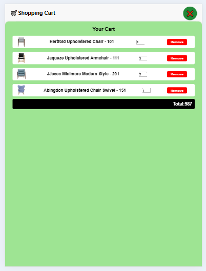
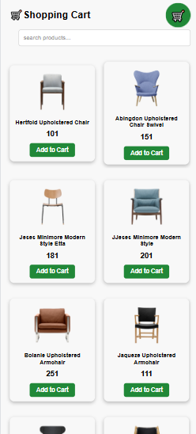
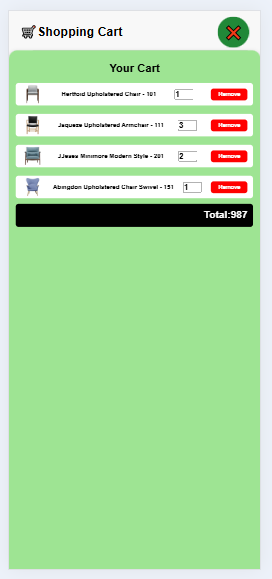

# E-Commerce Demo Website 🛍️

A responsive **E-Commerce** front-end built with **HTML, CSS, and JavaScript**.  
This project is a polished demo of product listing, product details, shopping cart interactions, and a checkout UI (frontend only).

---


## 🚀 Live Demo  

👉 **[Click Here to View Website](https://hemasri823.github.io/ECOMMERCE_WEBSITE/)**


---

## ✨ Features
- Responsive product listing (grid)
- Product detail modal / page
- Add to cart, update quantity, remove from cart
- Cart total calculation & simple checkout UI
- Search and basic client-side filtering
- Mobile-first responsive design
- Clean, modern UI with accessibility basics

---

## 🛠 Tech Stack
- **HTML5** — semantic markup
- **CSS3** — responsive layout, Flexbox / Grid, transitions
- **JavaScript (vanilla)** — DOM manipulation, cart logic, localStorage
- (Optional) Tiny libraries you used (e.g., Swiper, AOS) — list them here

---

## 📁 Project Structure
```
ecommerce-frontend/
├── index.html
├── css/
│   └── style.css
├── js/
│   └── Script.js
├── images/                  # product images, icons
├── screenshots/
├── README.md
└── assets/                  # fonts, additional assets
```

---

## ⚙️ How to Run (Locally)
This is a static site — no backend required.

1. Clone the repo:
```bash
git clone https://github.com/yourusername/your-ecommerce-repo.git
cd your-ecommerce-repo
2.Open index.html in your browser

Double-click index.html or run a simple HTTP server:

# Python 3
python -m http.server 8000
# then open http://localhost:8000
🧩 Notes / Extending the Project

=>Currently frontend-only. To make it production-ready:

    .Add a backend (Node/Express, Django, Flask) for orders and auth

    .Use a proper DB to store products & orders

    .Add payment gateway integration (Stripe/PayPal)

    .Implement server-side search & pagination

=>Performance: compress images and enable lazy-loading for product images.
## 📸 Screenshots

### Laptop View


###  Tab View



### Mobile view



